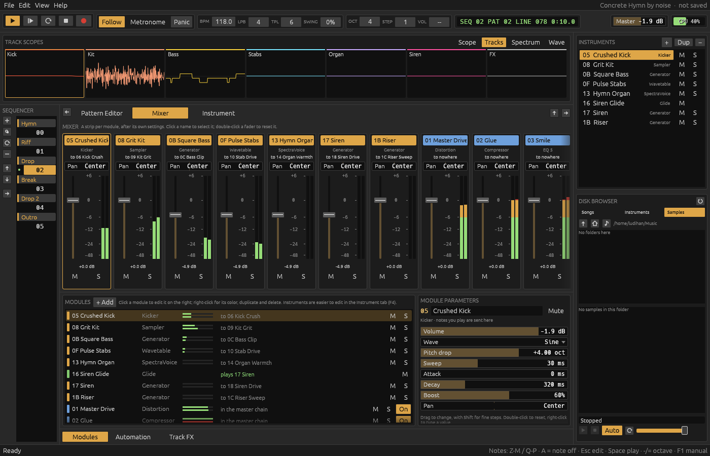

# noise

A music tracker with modular synths, written in Rust: a pattern editor and
an instrument editor over synth and effect modules. Notes in the pattern go
straight to synth modules, and each instrument's sound goes through a chain
of effect modules.

Press `F1` for the manual, which covers every part of the program, the keys
and the effect commands.


## Building

```sh
cargo run --release
```

On Linux, building needs the ALSA development headers (`alsa-lib-devel` or
`libasound2-dev`).

```sh
noise                              # open the demo song
noise "My Song"                    # open a project folder (or a song file)
noise "My Song.noise"              # import an exported project and open it
noise --export "My Song" out.wav   # render a song to WAV, no window
noise --demo-wav [out.wav]         # render the demo song
```

## Features

- **Pattern editor** with up to eight note and eight effect columns a
  track, panning and delay columns, block edits, a block loop, MIDI input, and effect commands
  for arpeggio, slides, vibrato, tremolo, tremor, auto-pan, cuts, delays, retriggers, tempo,
  pattern breaks, line waits, reversed and sliced samples, `Yxx` (maybe play) and `Zxx`
  (pick a phrase), and fades, slides, glides, cuts and retriggers in the volume column.
- **Track effects**, on top of each instrument's
  own, **groups** that send tracks on through another track's effects as a
  bus, a per-track volume command (`Lxx`), and a **master chain** of
  effects for the whole mix.
- **Pattern sequencer and matrix** with per-slot mutes, block copying and
  sections, drag and drop and a right-click menu for slots; a **mixer**
  strip for every module; **automation** envelopes of a pattern or part of
  one, picked from a filtered parameter browser.
- **Modules**: Generator, Wavetable (morphing, band-limited tables with unison), FM, Drums, Kicker, SpectraVoice, FMX, Sampler, Granular (a sample as a cloud of grains), Input (the sound card's input, live), MultiSynth, Glide (portamento between notes) and Modulator (LFO with
  drawn shapes synced to beats, follower, key and velocity tracker,
  envelope, or a knob);
  Filter, Filter Pro, Analog Filter, Distortion, Delay, Echo, Reverb, Plate Reverb, Convolver (built-in or loaded impulses), Amplifier, LFO, Flanger, Chorus, Phaser,
  Vocal Filter, Repeater, Multitap Delay, Ring Mod, WaveShaper, Scream Filter, Pitch Shifter, Vibrato, Stereo Expander, Comb Filter, Exciter, Cabinet Simulator, DC Blocker, Gate, Compressor, Maximizer, EQ, EQ 5 and EQ 10. Device chains with presets.
- **Sampler** with keyzones, a waveform editor with time-stretch, a slicer, per-voice pitch
  and filter envelopes and LFOs, beat sync, autoseek and mute groups. Loads WAV, FLAC
  and Ogg Vorbis, and **SF2, SF3 and SFZ soundfonts**; records the audio input or the song (resampling).
- **Presets** for instruments (with their samples and effects) and for
  devices: factory ones from the demo song, and your own, kept where
  XDG says.
- **Phrases**: short patterns an instrument plays for its notes, picked by
  program, key map or `Zxx`.
- A **disk browser** with a preview strip: play and stop,
  autoplay on click (in the Sampler's sample list too), loop and volume.
- Rendering the song, a block or **stems** (a file per instrument) to WAV.
- Scopes, track scopes (after a track's effects), a spectrum and a wave
  view; frames shown and hidden with arrows beside them.
- Songs that loop, or end on an `F00`; playing from the
  top of a pattern or from any line in it.
- **Project folders**: a song is saved as a folder with its song file and
  every sample it plays, each named by a hash of its audio, so the same
  audio is kept once; samples nothing plays any more are deleted on save.
  **Export and import** projects as `.noise` files, zip archives of
  their folders.
- **Backups** every few minutes of a song with unsaved changes.



## Code layout

| File | Contents |
|---|---|
| `src/demo.rs` | The first demo song, the piano and swell samples it renders, and what the demo songs share: drum hits, device chains, rolls |
| `src/static_heart.rs` | The second demo song, and the vocal and breakbeat samples it renders |
| `src/clockwork_rain.rs` | The third demo song, and the breakbeat and crackle samples it renders |
| `src/prism_overdrive.rs` | The fourth demo song, and the kit and orchestra hit it renders |
| `src/project.rs` | Song data (patterns and their automation, the order list, tracks, modules, links); saved as JSON |
| `src/project_dir.rs` | Project folders: saving a song with its samples named by hashes, deleting the unused ones; export and import as `.noise` files (zip archives) |
| `src/dsp/` | The audio code for every module, a file to each family (`filters.rs`, `delays.rs`, `fm.rs`, `sampler.rs`…); `mod.rs` holds the `Dsp` trait, `create`, envelopes and voices, `tests.rs` the tests they share |
| `src/sample.rs` | Loading WAV, FLAC and Ogg Vorbis samples; saving WAV |
| `src/soundfont.rs` | SF2, SF3 and SFZ soundfonts turned into Sampler samples |
| `src/engine.rs` | The sequencer, effects, automation, mixer and modules, run on the audio thread |
| `src/audio.rs` | Sound device output and WAV export |
| `src/midi.rs` | MIDI keyboard input |
| `src/ui/mod.rs` | The app: menu bar, transport, frames, song files and undo |
| `src/ui/pattern.rs`, `block.rs` | The pattern editor and track headers; block selection and edits |
| `src/ui/sequencer.rs` | The pattern sequencer and matrix |
| `src/ui/mixer.rs` | The mixer |
| `src/ui/modules.rs`, `routing.rs`, `widgets.rs` | The module list and parameter panel; wiring modules with lists to tick; the parameter bars |
| `src/ui/automation.rs` | The automation editor |
| `src/ui/sampler.rs`, `chain.rs`, `presets.rs`, `modulation.rs`, `phrase.rs`, `waveview.rs` | The instrument editor and the sampler, the device chain and its presets, the modulation and phrase pages, and the wave view |
| `src/ui/spectrum.rs`, `trackscopes.rs` | The spectrum analyzer; the track scopes |
| `src/ui/instruments.rs`, `browser.rs`, `files.rs`, `recorder.rs`, `help.rs`, `comments.rs`, `settings.rs`, `soundfonts.rs`, `theme.rs` | The instrument list, disk browser, file explorer, sample recorder, manual, song comments, preferences, the soundfont preset picker and colors |

The UI owns the song and sends a copy to the audio thread after each edit. The
engine keeps existing modules' state between copies, so notes and effect tails
keep sounding while you edit during playback.

## Notes for contributing

- `cargo test` covers the sequencer and effects (the engine tests swap a
  module's `Dsp` for one that records the note events it gets), every
  module at the ends of its parameters, the mixer, track and master
  effects, automation, the Sampler, block edits and song files. `cargo
  clippy` has no warnings; keep it that way, and run `cargo fmt`
  (`rustfmt.toml` keeps the code's wide lines).
- One feature per commit, with a title in the imperative and a short body.
  User-visible changes go in the manual (`ui/help.rs`), and in this README
  when they add to its feature list.
- Old songs must keep opening: new fields get serde defaults and old shapes
  are converted in `Project::load` (see `migrate_sampler`, `Track` and
  `Slot`). Parameters added to the end of a module's `ParamSpec` table load
  at their defaults.
- Note columns: the first one of each track is `Pattern::tracks`, the
  others `Pattern::extra`; effect columns are `Pattern::effects`, cells of
  which only `fx` is used. The editor and `ui/block.rs` work in lanes
  (every shown column, track by track, note columns before effect
  columns; `Pattern::lane_pos`), and the engine runs a channel per note
  column, `column * MAX_TRACKS + track`, gathering each line's effects
  (its own and the track's effect columns') in `Effects`.
- Track and master effects are placed rather than linked: `Track::effects`
  and `Project::master` list them, and `Project::signal_graph` builds the
  sound's whole path from the links and those lists. For each track with
  effects it copies the instruments the track plays (and their own
  chains), so a track's part stays apart through them; the engine keeps a
  node per copy (`Node::track`), sends a note to its track's copy through
  `Engine::copies`, and moves copies with their module's automation and
  Modulators. Songs without track effects get no copies.
- A Modulator's links are kept apart from audio as `Node::controls`; it
  runs before the modules it moves (`Engine::modulate`) and overrides
  their parameters for the block the way automation does.
- Note events reach modules through `Engine::note`, which a MultiSynth's
  node forwards to its `targets` (its note links, kept apart from audio
  `inputs`).
- Phrases: `Track` holds a track's note and effect state, and its
  `trigger`, `tick_effects` and `end_line` send note events through a
  closure, so pattern tracks and phrase players (`PhrasePlayer`, which
  holds a `Track`) share the effects. A `Zxx` reaches `phrase_event`
  through `Engine::picked_phrase`, set while its note is sent.
- Adding a module: a `ModuleKind` with a `ParamSpec` table (with units) in
  `project.rs`, added to `ADDABLE` and `info`, and a `Dsp` in `dsp/` made
  in `dsp::create`, in its family's file or one of its own. The files are
  declared after the `voice_controls!` macro in `dsp/mod.rs`, so they can
  use it; their items are `pub(super)`, for `create` and the tests.
  `Ctx::samples_per_line` gives the tempo for synced rates. The demo song
  (`demo.rs`) must use it, and the manual (`ui/help.rs`) describe it:
  tests check both.
- The audio thread must not block: the UI sends a new `Project` snapshot
  after each edit, and the engine publishes its state through atomics and
  `try_lock` in `Shared`. Slow work on the UI side, such as decoding a
  soundfont, runs on a thread and is picked up a frame later.
- Files go where `paths.rs` (the `directories` crate) says: settings in the
  config folder, the user's presets in the data folder. Factory presets are
  the demo song's modules (`ui/library.rs`), never written out.
- Icons are drawn in `ui/icons.rs`; the UI uses no emoji, and the default
  font has no arrows, so text uses words ("to 03 Drum Bus") instead.
- The screenshots were made headless with a temporary module that was
  never committed, `src/ui/shots.rs` (declared in `ui/mod.rs` under
  `#[cfg(test)]`, so it can set the app's private state): `egui_kittest`
  (features `eframe`, `wgpu`, `snapshot`) as a dev-dependency,
  `Harness::builder().with_size([1400, 900]).wgpu().build_eframe(|cc|
  App::new(cc, None))`, the view, slot and selected module set through
  `state_mut()`, real time let pass with `step` and short sleeps so the
  song plays (after stopping, wait until `is_playing()` turns false before
  playing again), and `render()` saved as PNG. It needs no window, so it
  works with the screen locked. Meanwhile mute the sound in `audio.rs`,
  and keep a copy of `~/.config/noise/settings.json`: the app saves its
  settings, including the disk browser's folders, when it closes.

## License

GPL-3.0. See [LICENSE](LICENSE).
